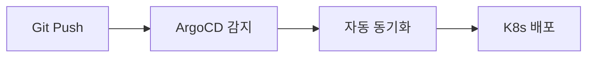
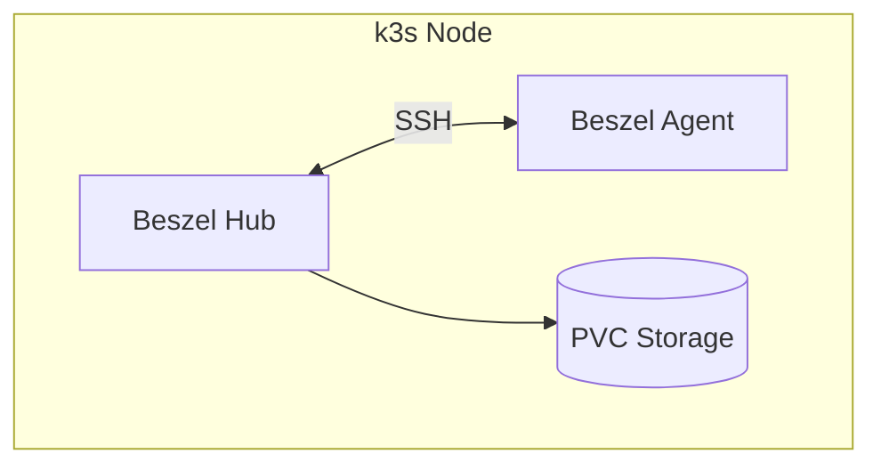

# AGENTS.md - Homelab k3s Infrastructure

This document provides guidance for AI coding agents working in this repository.

---

## CRITICAL: Secret Protection Rules

> **THIS IS A PUBLIC REPOSITORY. SECRETS MUST NEVER BE EXPOSED.**

### Absolute Prohibitions

| File Type | Action | Reason |
|-----------|--------|--------|
| `secret.yaml` | **NEVER commit** | Contains plaintext credentials |
| `*.pem`, `*.key` | **NEVER commit** | Private keys |
| `.env` files | **NEVER commit** | Environment secrets |
| API keys, passwords | **NEVER hardcode** | Use secretKeyRef |

### Allowed Secret Files

- `sealed-secret.yaml` - Encrypted by kubeseal, safe to commit
- `secret.yaml.example` - Template with placeholder values only

### Before Every Commit

```bash
# Verify no secrets are staged
git diff --cached --name-only | grep -E "secret\.yaml$|\.env$|\.pem$|\.key$"
# If any output appears, DO NOT COMMIT

# Check .gitignore is protecting secrets
cat .gitignore | grep secret
# Should show: **/secret.yaml
```

### If You Need to Create a Secret

1. Create `secret.yaml` locally (gitignored)
2. Encrypt with kubeseal: `kubeseal --cert=pub-cert.pem -f secret.yaml -w sealed-secret.yaml`
3. Commit only `sealed-secret.yaml`
4. Delete local `secret.yaml` or keep in secure storage

**VIOLATION = CREDENTIAL LEAK = SECURITY INCIDENT**

---

## Project Overview

GitOps-based Kubernetes homelab infrastructure using k3s and ArgoCD. This is **infrastructure-as-code**, not application source code. Changes are deployed via Git push → ArgoCD auto-sync.

**Tech Stack:**
- **Kubernetes**: k3s (lightweight K8s)
- **GitOps**: ArgoCD with App-of-Apps pattern
- **Configuration**: Kustomize overlays (local/production)
- **Ingress**: Traefik
- **TLS**: cert-manager with Let's Encrypt
- **Secrets**: Sealed Secrets (kubeseal)

## Hardware Specifications

This is a homelab environment. Configure resource limits appropriately.

| Resource | Spec | Notes |
|----------|------|-------|
| **CPU** | Intel N95 (4 cores, 4 threads) | Low-power efficiency CPU, no hyperthreading |
| **RAM** | 32GB DDR4 (Samsung, single slot) | ~29GB available for workloads |
| **OS Disk** | 238GB NVMe SSD | 100GB LVM for root filesystem |
| **Data Disk** | 500GB HDD | Mounted at `/mnt/ncdata` for k3s data |
| **OS** | Ubuntu 24.04.3 LTS | Kernel 6.8.x |

### Resource Allocation Guidelines

**Total cluster budget** (approximate):
- CPU: 4000m total, ~3500m allocatable
- Memory: 32Gi total, ~29Gi allocatable

**Current workload allocation (2025-02-09 기준):**

| Workload | CPU Req/Limit | Memory Req/Limit | Notes |
|----------|---------------|------------------|-------|
| OpenWebUI | 100m / 2000m | 256Mi / 2Gi | AI 챗 UI, 스파이크 대비 limit 높음 |
| n8n | 100m / 500m | 256Mi / 1Gi | 워크플로우 자동화 |
| n8n-postgres | 50m / 500m | 128Mi / 1Gi | DB 캐시 활용 |
| Ghost | 50m / 300m | 192Mi / 512Mi | Headless CMS |
| Ghost MySQL | 100m / 500m | 256Mi / 1Gi | InnoDB buffer pool 여유 |
| Beszel Hub | 10m / 100m | 32Mi / 128Mi | 모니터링 |
| Beszel Agent | 5m / 50m | 16Mi / 64Mi | 호스트 메트릭 수집 |
| **합계** | **415m / 3950m** | **1136Mi / ~5.7Gi** | |

**Memory budget:**

| Category | Amount |
|----------|--------|
| Total allocatable | ~29Gi |
| System + k3s headroom | -3Gi |
| Infrastructure (ArgoCD, cert-manager, etc.) | ~2Gi |
| App workloads (limits 합계) | ~5.7Gi |
| **Available for new apps** | **~18Gi** |

**Per-application tier guidelines (신규 앱 배포 시 참고):**

| App Type | CPU Request | CPU Limit | Memory Request | Memory Limit |
|----------|-------------|-----------|----------------|--------------|
| Lightweight (whoami, static) | 10m | 100m | 32Mi | 128Mi |
| Standard (Ghost, n8n) | 50-100m | 300-500m | 192-256Mi | 512Mi-1Gi |
| Heavy (OpenWebUI) | 100m | 1500-2000m | 256Mi | 2Gi |
| Database (MySQL, PostgreSQL) | 50-100m | 500m | 128-256Mi | 1Gi |
| Infrastructure (ArgoCD, etc.) | 50m | 200m | 128Mi | 256Mi |

**Important constraints:**
- Always set both `requests` and `limits`
- Leave ~3Gi memory headroom for system + k3s
- Avoid CPU limits > 2000m for non-critical apps
- Single replica only (`replicas: 1`) - no HA capacity

### Adding a New Application — Resource Allocation Process

신규 애플리케이션 배포 시, 반드시 아래 프로세스를 따라 리소스를 할당한다.

**Step 1: 현재 클러스터 상태 파악**

```bash
# 노드 전체 리소스 사용량
kubectl top nodes

# 모든 Pod 리소스 사용량
kubectl top pods -A

# 현재 requests/limits 총합 확인
kubectl describe node | grep -A 5 "Allocated resources"
```

**Step 2: 앱 특성 분류**

아래 기준으로 앱을 분류하고, 위 tier guidelines 테이블을 참고하여 초기값을 설정한다.

| 분류 기준 | Lightweight | Standard | Heavy |
|-----------|------------|----------|-------|
| 트래픽 패턴 | 거의 없음 | 간헐적 | 상시/버스트 |
| 메모리 특성 | 정적 | 점진적 증가 | 큰 변동폭 |
| CPU 특성 | idle 상태 | 이벤트 기반 | 연산 집약 |
| 예시 | whoami, static site | CMS, 자동화 | AI UI, API gateway |

**Step 3: 예산 검증**

새 앱의 memory limit을 현재 "Available for new apps" 예산과 대조한다. 예산 초과 시 기존 워크로드의 limit을 재조정하거나 배포를 보류한다.

```
Available budget >= New app memory limit  →  배포 가능
Available budget <  New app memory limit  →  기존 앱 재조정 또는 보류
```

**Step 4: 배포 후 모니터링**

배포 후 최소 24시간 동안 실제 사용량을 관찰하고, request/limit을 실측 기반으로 조정한다.

```bash
# 특정 앱의 리소스 사용량 추적
kubectl top pods -l app=<app-name> --containers
```

> **원칙**: request는 실사용량의 1.2~1.5배, limit은 실사용량의 3~5배를 기준으로 설정한다. 단, DB 워크로드는 캐시 효과를 고려하여 limit을 넉넉히 잡는다.

## Project Structure

```
├── infrastructure/          # Core infrastructure components
│   ├── argocd/             # ArgoCD installation (Kustomize)
│   ├── cert-manager/       # TLS certificate management
│   │   ├── base/           # Base installation
│   │   └── overlays/       # local/production issuers
│   ├── base/               # Shared infrastructure
│   │   ├── sealed-secrets/ # Secret encryption
│   │   ├── traefik/        # Ingress controller
│   │   └── cloudflared/    # Cloudflare tunnel
│   └── overlays/           # Environment-specific configs
│       ├── local/          # k3d local development
│       └── production/     # Production server
├── applications/           # Application deployments
│   ├── openwebui/         # AI chat interface
│   ├── ghost/             # Headless CMS
│   ├── n8n/               # Workflow automation
│   └── test-app/          # whoami test service
├── argocd/                # ArgoCD Application definitions
│   └── applications/      # App-of-Apps manifests
└── setup/                 # Installation scripts
    ├── k3s-install.sh     # k3s installation (Ubuntu)
    ├── bootstrap-infra.sh # Infrastructure bootstrap
    └── k3d-cluster.sh     # Local dev cluster
```

## Build/Validation Commands

This project has no traditional build system. Validation is done via kubectl/kustomize.

### Validate Manifests

```bash
# Validate a kustomization
kustomize build infrastructure/overlays/production | kubectl apply --dry-run=client -f -

# Validate single manifest
kubectl apply --dry-run=client -f applications/openwebui/deployment.yaml

# Check kustomization syntax
kustomize build applications/openwebui
```

### Local Development (k3d)

```bash
# Create local cluster
./setup/k3d-cluster.sh

# Apply local infrastructure
kubectl apply -k infrastructure/overlays/local/

# Apply specific application
kubectl apply -k applications/openwebui/
```

### Production Deployment

```bash
# Install k3s (first time only)
./setup/k3s-install.sh

# Bootstrap infrastructure
./setup/bootstrap-infra.sh --overlay production

# With ArgoCD apps
./setup/bootstrap-infra.sh --overlay production --apply-apps
```

### Useful kubectl Commands

```bash
# Check cluster status
kubectl get nodes
kubectl get pods -A

# ArgoCD applications
kubectl get applications -n argocd

# Certificates
kubectl get certificate -A

# Logs
kubectl logs -n default -l app=openwebui --tail=100 -f
```

## Code Style Guidelines

### YAML (Kubernetes Manifests)

**Formatting:**
- 2-space indentation (no tabs)
- One blank line between resources in multi-document files
- Use `---` separator between documents

**Resource Structure:**
```yaml
apiVersion: apps/v1
kind: Deployment
metadata:
  name: app-name
  namespace: default        # Always explicit
  labels:
    app: app-name
    component: frontend     # Use when app has multiple components
spec:
  replicas: 1
  selector:
    matchLabels:
      app: app-name
  template:
    metadata:
      labels:
        app: app-name
    spec:
      containers:
        - name: app-name
          image: registry/image:tag  # Comment with source URL
          imagePullPolicy: IfNotPresent
          ports:
            - containerPort: 8080
          env:
            - name: ENV_VAR
              value: "string-value"
            - name: SECRET_VAR
              valueFrom:
                secretKeyRef:
                  name: app-secret
                  key: secret-key
          resources:
            requests:
              cpu: "100m"
              memory: "256Mi"
            limits:
              cpu: "500m"
              memory: "512Mi"
```

**Naming Conventions:**
- Resource names: lowercase with hyphens (`openwebui`, `ghost-mysql`)
- Labels: `app`, `component` for pod selection
- Secrets: `{app}-secret` pattern
- PVCs: `{app}-data` or `{app}-{purpose}` pattern
- Services: same name as deployment

**Comments:**
- Korean comments are acceptable (bilingual codebase)
- Add source URLs for container images
- Document non-obvious configurations

### Mermaid Diagrams

문서에 다이어그램, 차트, 플로우차트 등 시각적 자료를 포함할 때 **Mermaid 문법을 적극 활용**한다.

**사용 시점:**
- 아키텍처 구성도 (컴포넌트 간 관계)
- 배포 플로우 / 워크플로우
- 시퀀스 다이어그램 (서비스 간 통신)
- 의사결정 흐름도
- 상태 다이어그램

**장점:**
- Git diff로 변경 추적 가능 (ASCII art는 diff가 무의미)
- GitHub / IDE에서 네이티브 렌더링 지원
- LLM이 구조를 정확히 파싱 가능

**예시:**





**금지:**
- ASCII art로 다이어그램 그리기 (`┌──┐`, `│`, `└──┘` 등) — 반드시 Mermaid로 대체
- 단, 디렉토리 트리 구조(`├──`, `└──`)는 코드 블록으로 유지 (Mermaid 부적합)

### Kustomization Files

```yaml
apiVersion: kustomize.config.k8s.io/v1beta1
kind: Kustomization

namespace: argocd  # Optional: override namespace

resources:
  - deployment.yaml
  - service.yaml
  - sealed-secret.yaml  # Never plain secret.yaml
```

### Bash Scripts (setup/*.sh)

**Header Pattern:**
```bash
#!/usr/bin/env bash
set -euo pipefail

# Brief description of script purpose
# - Additional context
# - Related scripts

usage() {
  cat <<'EOF'
Usage:
  ./setup/script-name.sh [options]

Options:
  --option-name <value>   Description
  -h, --help              Show help

Examples:
  ./setup/script-name.sh --option value
EOF
}
```

**Argument Parsing:**
```bash
OPTION_NAME="default"

while [[ $# -gt 0 ]]; do
  case "$1" in
    --option-name)
      OPTION_NAME="${2:-}"
      shift 2
      ;;
    -h|--help)
      usage
      exit 0
      ;;
    *)
      echo "Unknown option: $1" >&2
      usage >&2
      exit 2
      ;;
  esac
done
```

**Utility Functions:**
```bash
need_cmd() {
  command -v "$1" >/dev/null 2>&1 || { echo "ERROR: '$1' required." >&2; exit 1; }
}
```

**Output Style:**
- Use emoji prefixes for status messages
- Examples: `echo "📦 Installing..."`, `echo "✅ Done"`, `echo "⚠️ Warning"`

## Secret Management

**CRITICAL: Never commit `secret.yaml` files. Only `sealed-secret.yaml`.**

```bash
# Create sealed secret
kubeseal --cert=pub-cert.pem \
  -f applications/{app}/secret.yaml \
  -w applications/{app}/sealed-secret.yaml \
  --format yaml

# Verify .gitignore excludes secrets
# Pattern: **/secret.yaml (excluded), !**/sealed-secret.yaml (included)
```

## ArgoCD Application Pattern

```yaml
apiVersion: argoproj.io/v1alpha1
kind: Application
metadata:
  name: app-name
  namespace: argocd
  finalizers:
    - resources-finalizer.argocd.argoproj.io
spec:
  project: default
  source:
    repoURL: https://github.com/duchangkim/home-lab.git
    targetRevision: main
    path: applications/app-name
  destination:
    server: https://kubernetes.default.svc
    namespace: default
  syncPolicy:
    automated:
      prune: true
      selfHeal: true
    syncOptions:
      - CreateNamespace=true
```

## Common Patterns

### Multi-container Apps (e.g., Ghost + MySQL)

- Separate deployments: `deployment-app.yaml`, `deployment-db.yaml`
- Use component labels: `component: frontend`, `component: database`
- Internal service for DB: `ghost-mysql` (DNS-resolvable name)

### InitContainers for Setup

Used when base image needs modification (e.g., installing S3 adapter for Ghost):
```yaml
initContainers:
  - name: setup-task
    image: appropriate-image
    command: ["sh", "-c", "setup commands"]
    volumeMounts:
      - name: shared-volume
        mountPath: /path
```

### Resource Limits

**REQUIRED** - Always specify resource limits for all containers:

```yaml
resources:
  requests:
    cpu: "100m"      # Minimum guaranteed
    memory: "256Mi"
  limits:
    cpu: "500m"      # Maximum allowed
    memory: "512Mi"
```

See [Hardware Specifications](#hardware-specifications) for allocation guidelines.

## Validation Checklist

Before committing changes:

- [ ] `kustomize build <path>` succeeds
- [ ] `kubectl apply --dry-run=client -f <file>` validates
- [ ] No `secret.yaml` files staged (only `sealed-secret.yaml`)
- [ ] Resource limits specified for new deployments
- [ ] Namespace explicitly set in metadata
- [ ] Labels consistent with existing patterns
