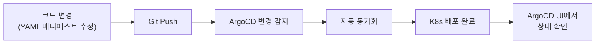

# 홈랩 k3s 관리 프로젝트

k3s와 ArgoCD를 사용한 GitOps 기반 홈서버 관리 프로젝트입니다.

## 🏠 운영 중인 서비스

| 서비스 | 설명 | URL |
|--------|------|-----|
| **OpenWebUI** | AI 챗봇 인터페이스 | https://ai.duchi.click |
| **Ghost CMS** | Headless CMS (콘텐츠 관리) | https://cms.duchi.click |
| **n8n** | 워크플로우 자동화 | https://n8n.duchi.click |
| **Beszel** | 서버 모니터링 (Cloudflare Access) | https://beszel.duchi.click |
| **ArgoCD** | GitOps CD 플랫폼 | https://argocd.duchi.click |
| **Traefik** | Ingress Controller | http://traefik.duchi.click |

## 💻 하드웨어 스펙

| 항목 | 스펙 |
|------|------|
| **CPU** | Intel N95 (4코어/4스레드) |
| **RAM** | 32GB DDR4 (Samsung) |
| **OS 디스크** | 238GB NVMe SSD |
| **데이터 디스크** | 500GB HDD (`/mnt/ncdata`) |
| **OS** | Ubuntu 24.04.3 LTS |

> 리소스가 제한된 환경입니다. 애플리케이션 배포 시 적절한 리소스 제한을 설정하세요.

## 📁 프로젝트 구조

```
├── infrastructure/           # 기반 인프라
│   ├── argocd/              # ArgoCD 설치 (Kustomize)
│   ├── argocd-image-updater/# 이미지 자동 업데이트
│   ├── cert-manager/        # TLS 인증서 관리
│   │   ├── base/            # cert-manager 설치
│   │   └── overlays/        # local/production Issuer
│   ├── base/                # 공유 인프라
│   │   ├── sealed-secrets/  # Secret 암호화
│   │   ├── traefik/         # Ingress 대시보드
│   │   └── cloudflared/     # Cloudflare Tunnel
│   └── overlays/            # 환경별 설정
│       ├── local/           # k3d 로컬 개발
│       └── production/      # 운영 서버
├── applications/            # 애플리케이션 매니페스트
│   ├── openwebui/          # AI 챗봇 UI
│   ├── ghost/              # Headless CMS + MySQL
│   ├── n8n/                # 워크플로우 자동화 + PostgreSQL
│   ├── beszel/             # 서버 모니터링 (Hub + Agent)
│   └── test-app/           # 테스트 앱 (whoami)
├── argocd/                 # ArgoCD Application 정의
│   └── applications/       # App-of-Apps 매니페스트
└── setup/                  # 설치 스크립트
    ├── k3s-install.sh      # k3s 설치 (Ubuntu)
    ├── bootstrap-infra.sh  # 인프라 부트스트랩
    └── k3d-cluster.sh      # 로컬 클러스터 생성
```

## 🚀 운영 환경 배포

### 빠른 시작

```bash
# 1. k3s 설치 (Ubuntu)
./setup/k3s-install.sh

# 2. 인프라 부트스트랩
./setup/bootstrap-infra.sh --overlay production

# 3. ArgoCD Applications 적용 (선택)
./setup/bootstrap-infra.sh --overlay production --apply-apps
```

### k3s 설치 옵션

```bash
# 기본 설치
./setup/k3s-install.sh

# 큰 디스크로 data-dir 설정
./setup/k3s-install.sh --use-big-disk

# 커스텀 data-dir 지정
./setup/k3s-install.sh --data-dir /mnt/storage/k3s
```

## 🧪 로컬 개발 환경 (k3d)

```bash
# 1. 클러스터 생성
./setup/k3d-cluster.sh

# 2. 로컬 인프라 설치
kubectl apply -k infrastructure/overlays/local/

# 3. ArgoCD 비밀번호 확인
kubectl -n argocd get secret argocd-initial-admin-secret \
  -o jsonpath="{.data.password}" | base64 -d; echo

# 4. /etc/hosts 설정
echo "127.0.0.1 argocd.local ai.local traefik.local" | sudo tee -a /etc/hosts

# 5. 애플리케이션 배포
kubectl apply -f argocd/applications/openwebui.yaml
kubectl apply -f argocd/applications/test-app.yaml
```

> ⚠️ 로컬 환경은 Self-Signed 인증서를 사용합니다. 브라우저 경고를 무시하세요.

## 🔒 Secret 관리

이 프로젝트는 **Sealed Secrets**를 사용하여 민감한 정보를 안전하게 Git에 저장합니다.

### Secret 생성 워크플로우

```bash
# 1. secret.yaml 작성 (로컬에만 보관)
cat > applications/{app}/secret.yaml <<EOF
apiVersion: v1
kind: Secret
metadata:
  name: my-secret
  namespace: default
stringData:
  password: "실제-비밀번호"
EOF

# 2. Sealed Secret으로 암호화
kubeseal --cert=pub-cert.pem \
  -f applications/{app}/secret.yaml \
  -w applications/{app}/sealed-secret.yaml \
  --format yaml

# 3. 암호화된 파일만 커밋
git add applications/{app}/sealed-secret.yaml
git commit -m "Add sealed secret for {app}"
```

> ⚠️ `secret.yaml`은 `.gitignore`에 의해 자동으로 제외됩니다. 절대 커밋하지 마세요.

자세한 내용: [infrastructure/base/sealed-secrets/README.md](infrastructure/base/sealed-secrets/README.md)

## 🔄 GitOps 워크플로우



## 🛠️ 유용한 명령어

```bash
# 클러스터 상태
kubectl get nodes
kubectl get pods -A

# ArgoCD 애플리케이션
kubectl get applications -n argocd

# 인증서 상태
kubectl get certificate -A

# 로그 확인
kubectl logs -n default -l app=openwebui --tail=100 -f

# Sealed Secret 컨트롤러 상태
kubectl get pods -n kube-system | grep sealed-secrets
```

## 📚 참고 자료

- [k3s 공식 문서](https://docs.k3s.io/)
- [ArgoCD 공식 문서](https://argo-cd.readthedocs.io/)
- [Sealed Secrets](https://github.com/bitnami-labs/sealed-secrets)
- [cert-manager](https://cert-manager.io/)
- [Kustomize](https://kustomize.io/)
