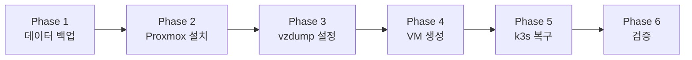

# Proxmox 마이그레이션 실행 가이드

Ubuntu(bare-metal k3s) → Proxmox VE(VM 위 k3s) 마이그레이션을 위한 단계별 실행 가이드.

---

## 전체 흐름



| Phase | 작업 유형 | 예상 시간 |
|-------|-----------|-----------|
| 1. 데이터 백업 | Mac에서 SSH (원격) | ~30분 |
| 2. Proxmox 설치 | 모니터+키보드 (물리) | ~40분 |
| 3. vzdump 설정 | 브라우저 (원격) | ~5분 |
| 4. VM 생성 + Ubuntu 설치 | 브라우저 (원격) | ~30분 |
| 5. k3s + 데이터 복구 | Mac에서 SSH (원격) | ~25분 |
| 6. 검증 | 브라우저 (원격) | ~15분 |
| **합계** | | **~2.5시간** |

---

## 시작 전 체크리스트

- [ ] 모니터 + 키보드 + USB (Proxmox 설치 미디어용) 준비
- [ ] Mac에서 `ssh homelab` 접속 가능 확인
- [ ] 5개 sealed-secret 원본 (평문 `secret.yaml`) 로컬에 있는지 확인
  - `applications/openwebui/secret.yaml`
  - `applications/ghost/secret.yaml`
  - `applications/n8n/secret.yaml`
  - `applications/beszel/secret.yaml`
  - `infrastructure/base/cloudflared/secret.yaml`
- [ ] Git 작업 브랜치에 미커밋 변경 사항 없는지 확인

---

## Phase 1: 데이터 백업

> **작업 유형:** Mac 터미널에서 SSH
>
> **주의:** 이 단계를 완료하고 Mac에 백업이 안전하게 전송된 것을 확인한 후에만 Phase 2로 넘어가세요. Phase 2에서 NVMe를 포맷합니다.

### 1-1. 백업 스크립트를 서버에 반영

로컬에서 새로 추가된 백업 스크립트를 서버에 반영합니다.

```bash
# Mac 터미널에서
cd ~/workspace/homelab
git pull  # 또는 최신 상태 확인

# 서버에 동기화
ssh homelab "cd ~/workspace/home-lab && git pull"
```

### 1-2. dry-run으로 사전 검증

```bash
ssh homelab "~/workspace/home-lab/setup/backup-k3s-data.sh --dry-run"
```

모든 항목에 ✅ 가 표시되는지 확인합니다. ⚠️ 가 있으면 해당 Pod 상태를 점검하세요:

```bash
ssh homelab "kubectl get pods -n default"
```

### 1-3. 백업 실행 + Mac 전송

**방법 A: 스크립트 내 자동 전송 (추천)**

Mac에서 SSH를 받을 수 있도록 원격 로그인을 활성화합니다:

1. Mac: 시스템 설정 → 일반 → 공유 → 원격 로그인 활성화
2. Mac IP 확인: `ifconfig en0 | grep "inet "`

```bash
# 서버에서 실행 (Mac으로 자동 전송)
ssh homelab "~/workspace/home-lab/setup/backup-k3s-data.sh \
  --transfer-to <mac-user>@<mac-ip>:~/homelab-backup"
```

**방법 B: 수동 전송**

```bash
# 서버에서 백업 실행
ssh homelab "~/workspace/home-lab/setup/backup-k3s-data.sh"

# Mac에서 백업 가져오기
mkdir -p ~/homelab-backup
scp -r homelab:~/k3s-backup-* ~/homelab-backup/
```

### 1-4. 백업 검증

```bash
# Mac에서
cd ~/homelab-backup/k3s-backup-*

# 체크섬 검증
shasum -a 256 -c checksums.sha256

# 백업 요약 확인
cat backup-summary.txt

# 파일 목록 확인
find . -type f -exec ls -lh {} \;
```

**확인 필수 항목:**

| 파일 | 최소 예상 크기 | 없으면 |
|------|--------------|--------|
| `db/ghost-mysql.sql` | > 100KB | Ghost 글 데이터 손실 |
| `db/n8n-postgres.sql` | > 50KB | n8n 워크플로우 손실 |
| `files/openwebui-data.tar.gz` | > 500MB | 채팅 히스토리 손실 |
| `files/ghost-content.tar.gz` | > 10MB | Ghost 테마/설정 손실 |
| `files/n8n-data.tar.gz` | > 1KB | n8n encryption key 손실 |

> **Phase 1 완료.** Mac에 백업이 안전하게 있는 것을 확인한 후 Phase 2로 진행하세요.

---

## Phase 2: Proxmox VE 설치

> **작업 유형:** 물리 작업 (모니터 + 키보드 + USB)

### 2-1. 설치 USB 준비

Mac에서 Proxmox ISO를 다운로드하고 USB에 굽습니다.

**ISO 다운로드:**
- https://www.proxmox.com/en/downloads → Proxmox VE ISO Installer

**USB에 굽기 (Balena Etcher 또는 dd):**

```bash
# Etcher 사용 시: GUI에서 ISO 선택 → USB 선택 → Flash

# dd 사용 시 (주의: 디스크 이름 정확히 확인!)
diskutil list                     # USB 디스크 번호 확인 (예: /dev/disk4)
diskutil unmountDisk /dev/disk4
sudo dd if=proxmox-ve_*.iso of=/dev/rdisk4 bs=4M status=progress
diskutil eject /dev/disk4
```

### 2-2. BIOS 설정

서버에 모니터와 키보드를 연결하고 부팅합니다.

1. BIOS 진입 (보통 `DEL` 또는 `F2`)
2. 확인/설정:
   - **VT-x (Intel Virtualization Technology):** Enabled (VM 실행에 필수)
   - **VT-d (Directed I/O):** 있으면 Enabled (PCI passthrough 용, 지금 필수는 아님)
   - **Boot Order:** USB를 첫 번째로
   - **PL1 (CPU Power Limit 1):** N95 기준 6000~10000 권장 (기본값이 과도하게 높을 수 있음)
3. 저장 후 재부팅

> **참고:** VT-d 설정을 BIOS에서 찾을 수 없는 경우가 있습니다.
> VT-d는 PCI passthrough(물리 장치를 VM에 직접 할당)에만 필요하며,
> 일반적인 VM 운영에는 VT-x만 활성화되면 충분합니다. 나중에 필요 시 활성화하세요.

### 2-3. Proxmox 설치

USB로 부팅하면 Proxmox 인스톨러가 시작됩니다.

**화면별 설정:**

| 화면 | 항목 | 설정값 |
|------|------|--------|
| EULA | 동의 | `I agree` |
| Target Harddisk | 디스크 선택 | **NVMe 디스크** (238GB짜리) 선택. HDD(500GB)를 선택하지 않도록 주의! |
| Target Harddisk → Options | Filesystem | `ext4` |
| Target Harddisk → Options | hdsize | 기본값 (전체 사용) |
| Location and Time Zone | Country | South Korea |
| Location and Time Zone | Time zone | Asia/Seoul |
| Location and Time Zone | Keyboard | Korean / US (선호하는 것) |
| Administration Password | Password | 관리자 비밀번호 설정 (기억해둘 것!) |
| Administration Password | Email | `duchang.dev@gmail.com` (또는 원하는 이메일) |
| Management Network | Management Interface | 네트워크 인터페이스 선택 (보통 하나만 있음) |
| Management Network | Hostname (FQDN) | `pve.duchi.click` (또는 원하는 이름) |
| Management Network | IP Address (CIDR) | `192.168.0.100/24` (또는 원하는 고정 IP. **기존 k3s IP인 .43은 VM용으로 남겨둘 것**) |
| Management Network | Gateway | `192.168.0.1` (공유기 IP) |
| Management Network | DNS Server | `192.168.0.1` (또는 `8.8.8.8`) |
| Summary | 확인 후 | `Install` |

> **IP 할당 전략:**
> - Proxmox 호스트: `192.168.0.100` (새 IP)
> - k3s VM: `192.168.0.43` (기존 IP 유지 → DNS/Cloudflare 변경 불필요)

설치 완료 후 자동 재부팅됩니다. USB를 제거하세요.

### 2-4. 설치 후 초기 설정

서버가 재부팅되면 콘솔에 Proxmox Web UI 주소가 표시됩니다:

```
https://192.168.0.100:8006
```

**Mac 브라우저에서 Web UI 접속:**
- URL: `https://192.168.0.100:8006`
- 인증서 경고 무시 (self-signed)
- 로그인: `root` / 설치 시 설정한 비밀번호

**SSH로 접속하여 repo 설정:**

> SSH 키가 등록되어 있지 않으면 Proxmox Web UI → 노드 → Shell 을 사용하세요.
> Mac SSH 공개키 등록: `cat ~/.ssh/id_ed25519.pub` (또는 `id_rsa.pub`) 내용을 Proxmox의
> `~/.ssh/authorized_keys`에 추가하면 `ssh root@192.168.0.100`으로 접속 가능합니다.

```bash
# Proxmox 호스트에서 실행 (Web UI Shell 또는 콘솔)

# 1) Enterprise repo 비활성화 (구독 없으므로)
#    최신 Proxmox는 .sources (DEB822) 형식을 사용합니다.
#    .list 형식인 경우와 .sources 형식인 경우를 모두 처리합니다.
if [ -f /etc/apt/sources.list.d/pve-enterprise.sources ]; then
  mv /etc/apt/sources.list.d/pve-enterprise.sources /etc/apt/sources.list.d/pve-enterprise.sources.disabled
elif [ -f /etc/apt/sources.list.d/pve-enterprise.list ]; then
  sed -i 's/^deb/# deb/' /etc/apt/sources.list.d/pve-enterprise.list
fi

# 2) Ceph enterprise repo도 비활성화
if [ -f /etc/apt/sources.list.d/ceph.sources ]; then
  mv /etc/apt/sources.list.d/ceph.sources /etc/apt/sources.list.d/ceph.sources.disabled
elif [ -f /etc/apt/sources.list.d/ceph.list ]; then
  sed -i 's/^deb/# deb/' /etc/apt/sources.list.d/ceph.list
fi

# 3) No-Subscription repo 추가 (이미 존재하면 생략)
if [ ! -f /etc/apt/sources.list.d/pve-no-subscription.list ]; then
  echo "deb http://download.proxmox.com/debian/pve bookworm pve-no-subscription" \
    > /etc/apt/sources.list.d/pve-no-subscription.list
fi

# 4) 패키지 업데이트
apt update && apt dist-upgrade -y
```

### 2-5. HDD 스토리지 설정

```bash
# Proxmox 호스트에서 (SSH)

# 1) HDD 디스크 확인
lsblk
# sda (465.8G)가 HDD. 파티션 없는 상태인지 확인

# 2) 기존 파티션 정리 (이미 데이터 백업 완료)
wipefs -a /dev/sda

# 3) ext4로 포맷
mkfs.ext4 -L hdd-storage /dev/sda

# 4) 마운트 포인트 생성
mkdir -p /mnt/hdd-storage

# 5) UUID 확인 후 fstab에 등록 (재부팅 후 자동 마운트)
UUID=$(blkid -s UUID -o value /dev/sda)
echo "UUID=${UUID}  /mnt/hdd-storage  ext4  defaults  0  2" >> /etc/fstab

# 6) 마운트
mount /mnt/hdd-storage

# 7) 확인
df -h /mnt/hdd-storage
```

**Proxmox Web UI에서 스토리지 추가:**

1. Datacenter → Storage → Add → **Directory**
2. 설정:
   - **ID:** `hdd-storage`
   - **Directory:** `/mnt/hdd-storage`
   - **Content:** `Disk image, VZDump backup file, ISO image` (3개 모두 체크)
   - **Nodes:** All
3. Add 클릭

---

## Phase 3: vzdump 자동 백업 설정

> **작업 유형:** 브라우저 (Proxmox Web UI)

VM을 생성하기 전에 백업 스케줄을 먼저 설정합니다. VM이 생성되면 자동으로 백업 대상이 됩니다.

**Proxmox Web UI:**

1. Datacenter → Backup → Add
2. 설정:

| 항목 | 설정값 |
|------|--------|
| Storage | `hdd-storage` |
| Schedule | `03:00` (매일 새벽 3시) |
| Selection mode | `All` (모든 VM) |
| Send email to | (비워두거나 이메일 입력) |
| Compression | `ZSTD` |
| Mode | `Snapshot` |
| Retention → keep-last | `3` (최근 3개 보관) |

3. Create 클릭

> **이것이 NVMe 장애 또는 Proxmox 재설치 시 데이터를 보호하는 핵심 안전망입니다.**

---

## Phase 4: k3s VM 생성

> **작업 유형:** 브라우저 (Proxmox Web UI)

### 4-1. Ubuntu ISO 업로드

1. Proxmox Web UI → `hdd-storage` (또는 `local`) → ISO Images → Upload
2. Ubuntu 24.04 Server ISO 업로드
   - 다운로드: https://ubuntu.com/download/server

### 4-2. VM 생성

Proxmox Web UI 우측 상단 → **Create VM**

**General 탭:**

| 항목 | 설정값 |
|------|--------|
| Node | pve |
| VM ID | 100 |
| Name | k3s-node |
| Start at boot | 체크 |

**OS 탭:**

| 항목 | 설정값 |
|------|--------|
| ISO image | 업로드한 Ubuntu 24.04 ISO |
| Type | Linux |
| Version | 6.x - 2.6 Kernel |

**System 탭:**

| 항목 | 설정값 |
|------|--------|
| BIOS | Default (SeaBIOS) |
| Machine | q35 |
| SCSI Controller | VirtIO SCSI single |
| Qemu Agent | 체크 |

**Disks 탭:**

| 항목 | 설정값 |
|------|--------|
| Bus/Device | SCSI / 0 |
| Storage | local-lvm (NVMe) |
| Disk size | 100 (GiB) |
| Discard | 체크 |
| SSD emulation | 체크 |

**CPU 탭:**

| 항목 | 설정값 |
|------|--------|
| Sockets | 1 |
| Cores | 4 |
| Type | host |

**Memory 탭:**

| 항목 | 설정값 |
|------|--------|
| Memory (MiB) | 28672 (=28GB) |
| Ballooning | 체크 (Minimum: 4096) |

**Network 탭:**

| 항목 | 설정값 |
|------|--------|
| Bridge | vmbr0 |
| Model | VirtIO (paravirtualized) |
| Firewall | 체크 해제 (k3s가 자체 관리) |

**Confirm → Finish**

### 4-3. Ubuntu 설치

1. VM 100 (k3s-node) 선택 → Start
2. Console 탭에서 Ubuntu 설치 진행

**Ubuntu 설치 시 설정:**

| 항목 | 설정값 |
|------|--------|
| Language | English (또는 Korean) |
| Keyboard | Korean / US |
| Installation type | Ubuntu Server (minimized) |
| Network | **수동 설정** — IP: `192.168.0.43/24`, Gateway: `192.168.0.1`, DNS: `8.8.8.8` |
| Storage | 전체 디스크 사용 (100GB) |
| Username | 기존과 동일하게 설정 |
| SSH | OpenSSH 서버 설치 체크, 기존 SSH 공개키 입력 (또는 설치 후 추가) |

설치 완료 후 재부팅합니다. Proxmox Console 또는 SSH로 접속합니다.

### 4-4. VM 기본 세팅

```bash
# VM에 SSH 접속 (Mac에서)
ssh <user>@192.168.0.43

# 또는 기존 ssh config가 IP 기반이면 그대로:
ssh homelab
```

```bash
# VM 내부에서 실행

# 1) 패키지 업데이트
sudo apt update && sudo apt upgrade -y

# 2) 필수 패키지 설치
sudo apt install -y curl wget git qemu-guest-agent

# 3) QEMU Guest Agent 활성화 (Proxmox 모니터링용)
sudo systemctl enable --now qemu-guest-agent

# 4) SSH 키 설정 (아직 안 했다면)
mkdir -p ~/.ssh
# Mac의 공개키를 authorized_keys에 추가
echo "<your-public-key>" >> ~/.ssh/authorized_keys
chmod 700 ~/.ssh && chmod 600 ~/.ssh/authorized_keys
```

> **확인:** `ssh homelab`로 Mac에서 정상 접속되는지 테스트

---

## Phase 5: k3s 복구

> **작업 유형:** Mac 터미널에서 SSH

### 5-1. 리포지토리 클론

```bash
ssh homelab
```

```bash
# VM 내부에서
git clone https://github.com/duchangkim/home-lab.git ~/workspace/home-lab
cd ~/workspace/home-lab
```

### 5-2. k3s 설치

VM은 단일 가상 디스크(100GB NVMe)를 사용하므로 `--use-big-disk` 불필요합니다.

```bash
./setup/k3s-install.sh
```

설치 확인:
```bash
kubectl get nodes
# NAME        STATUS   ROLES                  AGE   VERSION
# k3s-node    Ready    control-plane,master   ...   v1.xx.x+k3s1
```

### 5-3. 인프라 부트스트랩

```bash
./setup/bootstrap-infra.sh --overlay production --apply-apps
```

이 명령어가 완료되면:
- ArgoCD, cert-manager, sealed-secrets, traefik, cloudflared가 설치됨
- ArgoCD가 모든 앱을 배포 시작 (빈 PVC로 실행)

**Sealed Secrets 컨트롤러가 준비될 때까지 대기:**

```bash
kubectl wait --for=condition=ready pod -l app.kubernetes.io/name=sealed-secrets \
  -n kube-system --timeout=120s
```

### 5-4. Sealed Secrets 재암호화

새 클러스터의 Sealed Secrets 컨트롤러가 새 키쌍을 생성했습니다. 모든 sealed-secret을 재암호화해야 합니다.

> **원칙:** 평문 secret.yaml은 VM에 전송하지 않습니다.
> VM에서 pub-cert.pem(공개키)만 가져와서 **로컬 Mac에서 kubeseal로 암호화**합니다.

**Mac에서 kubeseal 설치 (아직 없다면):**

```bash
brew install kubeseal
```

**VM에서 새 인증서 추출 → 로컬로 가져오기:**

```bash
# Mac 터미널에서
ssh homelab "KUBECONFIG=/etc/rancher/k3s/k3s.yaml kubeseal --fetch-cert \
  --controller-name=sealed-secrets-controller \
  --controller-namespace=kube-system" > ~/workspace/homelab/pub-cert.pem
```

> VM에 kubeseal이 없으면 먼저 설치:
> `ssh homelab` 후 VM에서:
> ```
> KUBESEAL_VERSION=0.24.0
> wget -q "https://github.com/bitnami-labs/sealed-secrets/releases/download/v${KUBESEAL_VERSION}/kubeseal-${KUBESEAL_VERSION}-linux-amd64.tar.gz"
> tar xzf "kubeseal-${KUBESEAL_VERSION}-linux-amd64.tar.gz"
> sudo mv kubeseal /usr/local/bin/ && rm -f "kubeseal-${KUBESEAL_VERSION}-linux-amd64.tar.gz"
> ```

**로컬 Mac에서 재암호화:**

```bash
cd ~/workspace/homelab

# 5개 앱 시크릿 재암호화
for app in openwebui ghost n8n beszel; do
  echo "Sealing $app..."
  kubeseal --cert=pub-cert.pem \
    -f "applications/${app}/secret.yaml" \
    -w "applications/${app}/sealed-secret.yaml" \
    --format yaml
done

# cloudflared 시크릿 재암호화
echo "Sealing cloudflared..."
kubeseal --cert=pub-cert.pem \
  -f infrastructure/base/cloudflared/secret.yaml \
  -w infrastructure/base/cloudflared/sealed-secret.yaml \
  --format yaml

# Git commit & push
git add pub-cert.pem applications/*/sealed-secret.yaml \
  infrastructure/base/cloudflared/sealed-secret.yaml
git commit -m "ops: re-encrypt sealed secrets for new cluster"
git push
```

**ArgoCD 동기화 확인 (VM에서):**

```bash
# ArgoCD가 새 커밋을 감지하지 못하면 강제 새로고침
for app in openwebui ghost n8n beszel infrastructure; do
  kubectl patch application $app -n argocd --type merge \
    -p '{"metadata":{"annotations":{"argocd.argoproj.io/refresh":"hard"}}}'
done

# 동기화 상태 확인
kubectl get applications -n argocd

# Secret이 정상 생성되었는지 확인
kubectl get secrets -n default | grep -E "ghost-secret|n8n-secret|openwebui-secret|beszel-secret"

# 모든 Pod가 Running이 될 때까지 대기
kubectl get pods -n default -w
```

### 5-5. 데이터 복원

**백업 파일을 VM으로 전송 (Mac에서):**

```bash
# Mac 터미널에서
scp -r ~/homelab-backup/k3s-backup-* homelab:~/
```

**DB 복원 (VM에서):**

```bash
# VM에서 — 백업 디렉토리 변수 설정
BACKUP_DIR=~/k3s-backup-*  # 실제 디렉토리명으로 변경

# Ghost MySQL 복원
GHOST_ROOT_PW=$(kubectl get secret ghost-secret -n default -o go-template='{{index .data "root-password"}}' | base64 -d)
kubectl exec -i deploy/ghost-mysql -n default -- \
  mysql -u root -p"${GHOST_ROOT_PW}" ghost_prod < "${BACKUP_DIR}/db/ghost-mysql.sql"

echo "Ghost MySQL 복원 완료"

# n8n PostgreSQL 복원
N8N_DB_USER=$(kubectl get secret n8n-secret -n default -o go-template='{{index .data "db-user"}}' | base64 -d)
kubectl exec -i deploy/n8n-postgres -n default -- \
  psql -U "${N8N_DB_USER}" -d n8n < "${BACKUP_DIR}/db/n8n-postgres.sql"

echo "n8n PostgreSQL 복원 완료"
```

**PVC 파일 복원 (VM에서):**

```bash
# OpenWebUI (채팅 히스토리 + SQLite DB)
kubectl exec -i deploy/openwebui -n default -- \
  tar xzf - -C / < "${BACKUP_DIR}/files/openwebui-data.tar.gz"

echo "OpenWebUI 데이터 복원 완료"

# Ghost 콘텐츠 (테마, 설정)
kubectl exec -i deploy/ghost -n default -- \
  tar xzf - -C / < "${BACKUP_DIR}/files/ghost-content.tar.gz"

echo "Ghost 콘텐츠 복원 완료"

# n8n 설정 (encryption key 포함)
kubectl exec -i deploy/n8n -n default -- \
  tar xzf - -C / < "${BACKUP_DIR}/files/n8n-data.tar.gz"

echo "n8n 설정 복원 완료"
```

**Pod 재시작 (복원된 데이터 반영):**

```bash
kubectl rollout restart deploy/openwebui deploy/ghost deploy/ghost-mysql \
  deploy/n8n deploy/n8n-postgres

# 모든 Pod이 Running이 될 때까지 대기
kubectl rollout status deploy/openwebui deploy/ghost deploy/ghost-mysql \
  deploy/n8n deploy/n8n-postgres
```

---

## Phase 6: 검증

> **작업 유형:** 브라우저 + SSH

### 6-1. 인프라 상태

```bash
# 모든 Pod 상태
kubectl get pods -A

# ArgoCD 동기화 상태
kubectl get applications -n argocd

# TLS 인증서 발급 상태
kubectl get certificate -A

# 모든 Certificate가 Ready=True가 되려면 수 분 걸릴 수 있음
```

### 6-2. 서비스별 확인

| # | 서비스 | URL | 확인 항목 |
|---|--------|-----|-----------|
| 1 | Proxmox | `https://192.168.0.100:8006` | Web UI 접근, VM 상태 |
| 2 | ArgoCD | `https://argocd.duchi.click` | 대시보드 접근, 모든 앱 Synced |
| 3 | OpenWebUI | `https://ai.duchi.click` | 로그인, **기존 채팅 히스토리 존재 여부** |
| 4 | Ghost | `https://cms.duchi.click/ghost` | 관리자 로그인, **기존 글 존재 여부** |
| 5 | n8n | `https://n8n.duchi.click` | 로그인, **기존 워크플로우 목록 확인** |
| 6 | Beszel | `https://beszel.duchi.click` | 서비스 접근 (이력은 빈 상태 — 정상) |
| 7 | whoami | `https://whoami.duchi.click` | 응답 확인 |

### 6-3. 외부 접근

```bash
# 외부 네트워크(모바일 데이터 등)에서 접근 테스트
# Cloudflare Tunnel을 통한 접근이 정상인지 확인
curl -s https://whoami.duchi.click
```

### 6-4. Proxmox 수동 백업 테스트

1. Proxmox Web UI → VM 100 (k3s-node) → Backup → Backup now
2. Storage: `hdd-storage`, Mode: `Snapshot`, Compression: `ZSTD`
3. 백업 완료 확인

---

## 검증 완료 후 정리

```bash
# VM 내부: 복원에 사용한 백업 파일 삭제 (선택)
rm -rf ~/k3s-backup-*

# Mac: 백업 파일은 당분간 보관 (최소 1주일)
# 안정적으로 운영되는 것을 확인한 후 삭제
```

---

## 트러블슈팅

### Proxmox 설치 시 NVMe가 보이지 않음

- BIOS에서 NVMe 관련 설정 확인
- Secure Boot 비활성화 시도

### VM에서 네트워크가 안 됨

```bash
# Proxmox 호스트에서 브릿지 확인
ip addr show vmbr0

# VM 내부에서 네트워크 설정 확인
ip addr
ip route
cat /etc/netplan/*.yaml
```

### ArgoCD 앱이 Sync 실패

```bash
# 앱별 상세 상태 확인
kubectl get application <app-name> -n argocd -o yaml

# 일반적인 원인: sealed-secret 복호화 실패 → Phase 5-4 재확인
kubectl get events -n default --sort-by=.lastTimestamp | tail -20
```

### Pod이 CrashLoopBackOff

```bash
# 로그 확인
kubectl logs deploy/<app-name> -n default --previous
kubectl describe pod -l app=<app-name> -n default
```

### TLS 인증서가 발급되지 않음

```bash
# cert-manager 로그 확인
kubectl logs -n cert-manager -l app.kubernetes.io/name=cert-manager --tail=50

# Challenge 상태 확인
kubectl get challenges -A
kubectl get orders -A

# 일반적인 원인: DNS가 아직 새 IP를 가리키지 않음
# → Cloudflare Tunnel이 정상 작동하면 DNS는 Cloudflare를 가리키므로 무관
```

### Cloudflare Tunnel이 연결되지 않음

```bash
# cloudflared Pod 상태
kubectl get pods -n kube-system -l app=cloudflared

# 로그 확인
kubectl logs -n kube-system -l app=cloudflared --tail=50

# 원인: cloudflared-token sealed-secret 복호화 실패 가능
# → Phase 5-4에서 cloudflared secret이 정상 암호화되었는지 확인
```

---

## 참고: 향후 Proxmox 재설치가 필요한 경우

Proxmox 패러다임에서는 OS와 데이터가 같은 NVMe에 있지만, **vzdump 자동 백업이 HDD에 있으므로** 복구가 간단합니다:

1. NVMe에 Proxmox 재설치 (Phase 2 반복)
2. HDD 마운트 + 스토리지 재등록 (Phase 2-5 반복)
3. vzdump 백업에서 VM 복원:
   - Proxmox Web UI → `hdd-storage` → Backups → 최신 백업 선택 → Restore
4. VM 시작 → 모든 것이 그대로 복원됨

이것이 k3s 데이터를 직접 백업/복원하는 것보다 훨씬 간단합니다.
